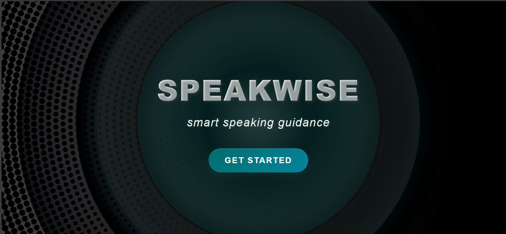
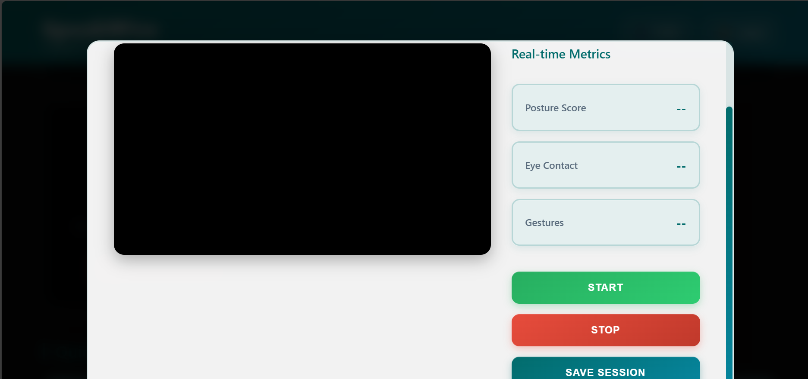
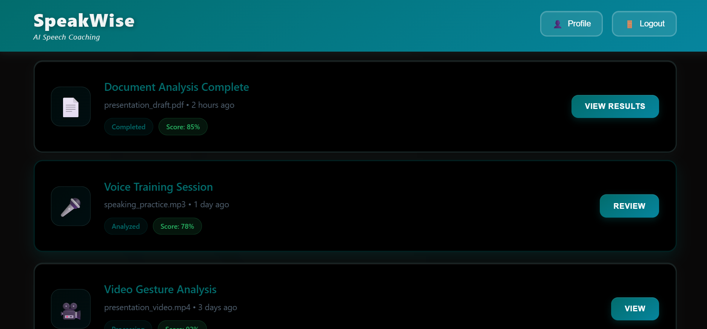

# SpeakWise 🎤  
**AI-powered presentation and public speaking coach**  

SpeakWise helps users enhance their communication skills by analyzing **content, vocal delivery, and visual presentation**. It provides personalized, AI-driven feedback to help you become a confident and engaging speaker.  
<h3 align="center">🏠 Home Page</h3>  

  

---

## ✨ Features  

### 📑 Content Analysis  
- Analyzes the structure and organization of presentation scripts.  
- Compares prepared scripts with spoken transcriptions to measure adherence vs. improvisation.  
- Provides AI-powered feedback on **clarity, engagement, and quality** (powered by Anthropic’s Claude).  

### 🎙️ Audio Analysis  
- High-accuracy **speech-to-text transcription** (OpenAI Whisper).  
- Detection of **filler words** (e.g., “um”, “uh”, “like”).  
- Voice quality analysis: **pitch, pace, volume, clarity**.  

### 🎥 Video Analysis  
- Real-time analysis with **OpenCV** and **MediaPipe**.  
- **Facial expression recognition**.  
- **Eye contact tracking**.  
- **Gesture and posture analysis**.
  <h3>📑 Analysis Report</h3>  
   

### 📊 User Dashboard  
- Upload **scripts, audio, and video files**.  
- View detailed **feedback reports** with scores and suggestions.  
- Track progress over time.  
- **Live analysis mode** for real-time feedback.
  <h3>📊 Dashboard</h3>  
   

---

## 🛠️ Tech Stack  

### Backend  
- **Framework:** Flask  
- **Database:** Flask-SQLAlchemy (SQLite)  
- **AI/ML:**  
  - Audio: OpenAI Whisper, librosa  
  - Video: OpenCV, MediaPipe  
  - Content: Anthropic API  
- **Deployment:** Gunicorn, Docker  

### Frontend  
- HTML5, CSS3, JavaScript  

---

## 🚀 Getting Started  

### Prerequisites  
- Python **3.10+**  
- Virtual environment (recommended)  

